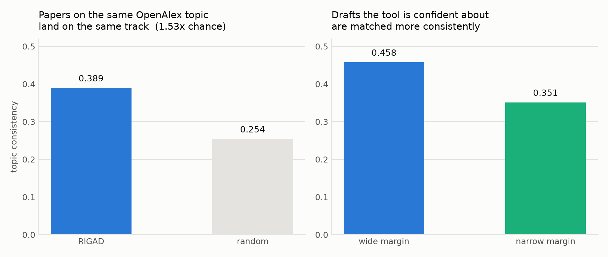
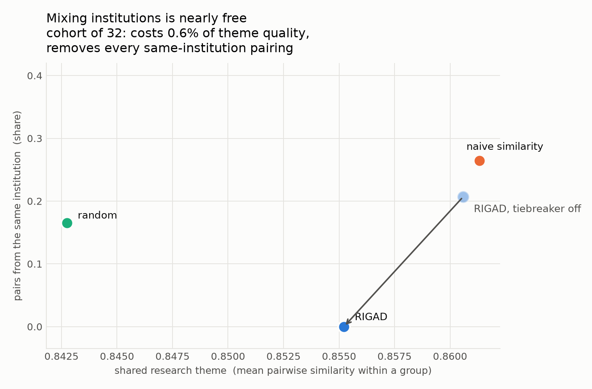

# RIGAD

**Point it at a folder of draft papers. It tells you where to submit them and who to talk to.**

For each draft:

- which **conference tracks** it fits, with a confidence rating and the reason
- which **EUTOPIA researchers at other institutions** work on related things

With five or more drafts it also proposes **working groups**, built around shared research themes.

Built for the [EUTOPIA](https://eutopia-university.eu/) Digitalisation Incubator (WP5.2) by the *Sustainable Digital Transformation* partnership. Five partner IS departments: Gothenburg, Warwick Business School, ESSEC, Arizona State and Monash.

> Working research prototype. The algorithms run, are tested, and are evaluated on real data. Nobody has yet used it on a live cohort, and this README does not pretend otherwise.

---

## Quickstart

```bash
git clone https://github.com/VasiliMan/rigad && cd rigad
uv venv && uv pip install -e ".[dev,neural]"
uv run jupyter lab notebooks/RIGAD.ipynb   # or open it and pick the "RIGAD (project venv)" kernel
```

Set one variable and run:

```python
DRAFTS_FOLDER = "../data/example_drafts"   # <- your folder
```

```python
from rigad import analyse
analyse(DRAFTS_FOLDER).show()
```

Drafts can be `.pdf`, `.docx`, `.txt` or `.md`, in any mix. Nothing leaves your machine; no account or API key is required.

### Institutions are optional, and free

```
my-drafts/                    my-drafts/
  alice.pdf                     gothenburg/alice.pdf
  bob.docx                      warwick/bob.docx
  chen.pdf                      essec/chen.pdf

no institutions —             subfolder = institution —
groups form on theme          theme first, mixing as tiebreaker
```

## What you get

```
Blockchain technologies to mitigate COVID-19 challenges: A scoping review
  blockchain_technologies_to_mitigate_covid_19.txt  ·  essec

  Suggested ICIS 2026 tracks
   → Blockchain, DLT, and Fintech                     0.356
       overall scope; closest listed topic: Sustainability, inclusivity
       and societal impact: green/blockchain energy trade-offs,
       financial inclusion via FinTech and DLT, AI-enabled financial
       services for underserved populations
     IoT, public IS, and infrastructures              0.312
       overall scope; closest listed topic: The use of IoT, AI, big
       data, blockchain and mixed reality technologies for smart city
       and smart community development and governance.
     Computational Design and Evaluation              0.308
       overall scope; closest listed topic: Computational design
       science of emerging digital technologies, such as immersive
       systems, IoT, robotics, etc.

   confidence: HIGH (margin 0.043) — the leading track is clearly ahead

  Possible mentors at other EUTOPIA institutions
     Kristian Rotaru              Monash     0.328  publishes IS research (not IS dept)
     Matthew J. Page              Monash     0.261  publishes IS research (not IS dept)
     Graham F. Medley             Warwick    0.197  publishes IS research (not IS dept)
```

**Confidence** is the gap to the runner-up, banded using the distribution measured over 3,622 real papers. A **LOW** rating is information, not failure — it usually means the draft genuinely straddles two communities, so choose by the audience you want.

---

## How it works

```
folder of drafts
      │  documents.py    read PDF/DOCX/TXT · subfolder = institution
      ▼
   embed.py              text → 384-dim vectors (local model, or TF-IDF fallback)
      │
      ├──► tracks.py     vs 24 ICIS 2026 tracks     → ranked tracks + confidence
      ├──► discover.py   vs 257 EUTOPIA researchers → mentors (never your own institution)
      └──► allocate.py   if ≥5 drafts               → groups by shared theme
```

1. **Read.** Text is pulled out of each `.pdf`, `.docx`, `.txt` or `.md`.
2. **Turn text into numbers.** A local model — [`intfloat/multilingual-e5-small`](https://huggingface.co/intfloat/multilingual-e5-small), run on your own machine via sentence-transformers — converts each draft into 384 numbers. The numbers are coordinates: text about similar things lands in a similar place, so *"digital transformation in hospitals"* sits beside *"IT-enabled organisational change in healthcare providers"* despite sharing no vocabulary.
3. **Do the same to the tracks.** The same model reads the conference's own published track descriptions, each split into its prose statement plus every listed topic of interest.
4. **Centre both.** Each set is shifted onto its average position. Raw sentence embeddings cluster in a narrow cone — every track scores within ~0.006 of every other — and centring widens those gaps roughly fivefold; it is the difference between a working ranking and noise.
5. **Compare.** Cosine similarity between each draft and every track. A track scores by its best-matching part, and its closest listed topic is reported as the human-readable reason.
6. **Rank and rate.** Tracks are ordered by score; the margin between the top two becomes the confidence rating, with bands calibrated on the distribution over 3,622 real papers.

The same draft vectors then drive the mentor suggestions and the grouping — one model, computed once. Drafts and reference texts must share one vector space, so each backend is fitted once and reused. Without the neural model installed, everything runs on the TF-IDF fallback, which needs no download at all.

---

## Does it work?

There is no public dataset of papers labelled with the track they were submitted to, so accuracy cannot be measured directly. Two things can be.

### Consistency

OpenAlex labels every paper with topics, independently of this tool. Papers sharing a topic should be routed to the same track. The baseline shuffles assignments, preserving topic structure and track frequencies.



| | |
|---|---|
| Drafts evaluated | 3,622 real publications |
| Topic consistency | **0.389** vs 0.254 random — **1.53×** |
| Consistency, wide margin | **0.458** |
| Consistency, narrow margin | 0.351 |

The margin result justifies showing confidence to a user: it predicts reliability.

### The institutions differ, in the way they should

Departments specialise, so an even spread across tracks would be the suspicious result. If the matcher reads real structure, the five institutions should show distinguishable, plausible profiles — and it never sees an institution label.

| | |
|---|---|
| χ² (institution × track), dof 88 | 492, **p = 2e-57** |
| Cramér's V | **0.185** — distinct but overlapping, as five IS departments should be |

| institution | most over-represented track | vs corpus |
|---|---|---|
| ASU | Economics of digital, social, and mobile commerce | 2.1×
| ESSEC | Data management and analytics | **2.6×**
| Gothenburg | Implementation and organizing | 2.0×
| Monash | Digital learning and pedagogy | 1.9×
| Warwick | General topics | 1.4× |

Recovered with no institutional input at all.

### Grouping: mixing institutions costs almost nothing

Groups are built around a **shared research theme** — that is the point of putting people in a room. Institutional mixing is a tiebreaker, applied only where it costs nothing thematically.

Evaluated at the sizes real events have: repeated random cohorts of 20–64 people drawn from the corpus, twelve draws per size. (The corpus is reference data; a workshop is what gets grouped. Running the allocator on all 514 people would produce 128 groups, which is a benchmark, not a use case.)



Cohort of 32, mean of 12 draws:

| strategy | shared theme | same-institution pairs | institutions per group |
|---|---|---|---|
| random | 0.843 | 0.17 | 3.08 |
| naive similarity clustering | **0.861** | 0.26 | 2.99 |
| **RIGAD** | 0.855 | **0.00** | **4.00** |
| RIGAD, tiebreaker switched off | 0.861 | 0.21 | 2.94 |

The last row is the finding. Turning the institutional tiebreaker off recovers just **0.006 of theme quality — under 1%** — while same-institution pairings jump from **zero to 0.21**. Mixing is essentially free, so there is no reason not to take it.

Naive similarity clustering is the *worst* at mixing (0.26, rising to 0.35 at 48 people), because it groups people who work on the same thing and those people disproportionately work in the same building.

> A diversity option (`beta=1.0` on `allocate`) exists for organisers who deliberately want dissimilar people grouped together. It is off by default: a group whose members share no topic at all scores perfectly on diversity, and such a group has no shared theme to meet about.

---

## Using your own conference

Nothing is specific to ICIS. A track file is JSON:

```json
{"conference": "Your Conference 2027",
 "tracks": [{"id": "a", "name": "Track A",
             "description": "What belongs in this track…",
             "topics": ["Topic of interest one", "Topic two"]}]}
```

Save it under `data/tracks/` and pass `tracks_file=` to `analyse()`. Well-written topics of interest produce better-explained matches.

## Layout

```
notebooks/RIGAD.ipynb      the artefact — set a folder, run
src/rigad/
  analyse.py               the one entry point; orchestrates the rest
  documents.py             read PDF/DOCX/TXT from a folder
  embed.py                 text → vectors
  tracks.py                draft → conference track
  discover.py              draft → mentor
  allocate.py              theme-first group formation
  corpus.py                OpenAlex client (used to build the data)
data/
  example_drafts/          six stand-in drafts so it runs on clone
  tracks/icis2026.json     24 tracks, 324 facets
  mentors/                 257 EUTOPIA researchers
  sample/                  researcher corpus behind the evaluation
scripts/                   data building and evaluation
docs/                      figures and evaluation metrics
```

Reproduce the evaluation:

```bash
uv run python scripts/evaluate_tracks.py   # track matching
uv run python scripts/evaluate.py          # group allocation
uv run python scripts/make_figures.py      # figures
uv run python -m pytest                    # 51 tests
```

## Data and provenance

- **Tracks** — [ICIS 2026](https://icis2026.aisconferences.org/submissions/track-descriptions/), parsed by `scripts/parse_icis_tracks.py`. Chair and editor names are stripped: they say nothing about what a track is about.
- **Mentors** — 257 researchers across five partner institutions: department staff resolved from public directories, plus researchers elsewhere in the same universities who publish in OpenAlex's information-systems subfields (CC0). Each is labelled with which route they came by.
- **Example drafts** — public abstracts standing in for unpublished work. Not real submissions.

Your own drafts are read locally and embedded on your machine. Nothing is uploaded, and no external service is called at run time.

> **OpenAlex note.** OpenAlex meters a daily credit budget, and a `search` filter costs **10 credits against 1** for a plain filter — enough to exhaust a day's allowance on a few hundred name lookups. `corpus.py` uses plain filters only, throttles, caches, and stops at a floor.

## Limitations

- **No live cohort yet.** Every number comes from published papers, not from people using the tool.
- **Consistency is a proxy**, not accuracy — it shows papers on a topic go to the same track, not that they go to the right one.
- **A topically narrow corpus.** The same specialisation that makes the institution test informative limits generalisation to a full, diverse submission pool.
- **Published papers are cleaner** than the in-progress drafts this is for.
- **Mentors cover five partner institutions**, not all of EUTOPIA. Monash contributes only 8 department staff against ASU's 40, so its share of the pool comes largely from publication output.
- **Scanned PDFs with no text layer are skipped** — reported, not silently dropped.

## License

MIT — see [LICENSE](LICENSE). Any EUTOPIA partner is free to fork and adapt it.

## Contact

For contact, reach Vasili Mankevich: <https://www.gu.se/en/about/find-staff/vasilimankevich>
